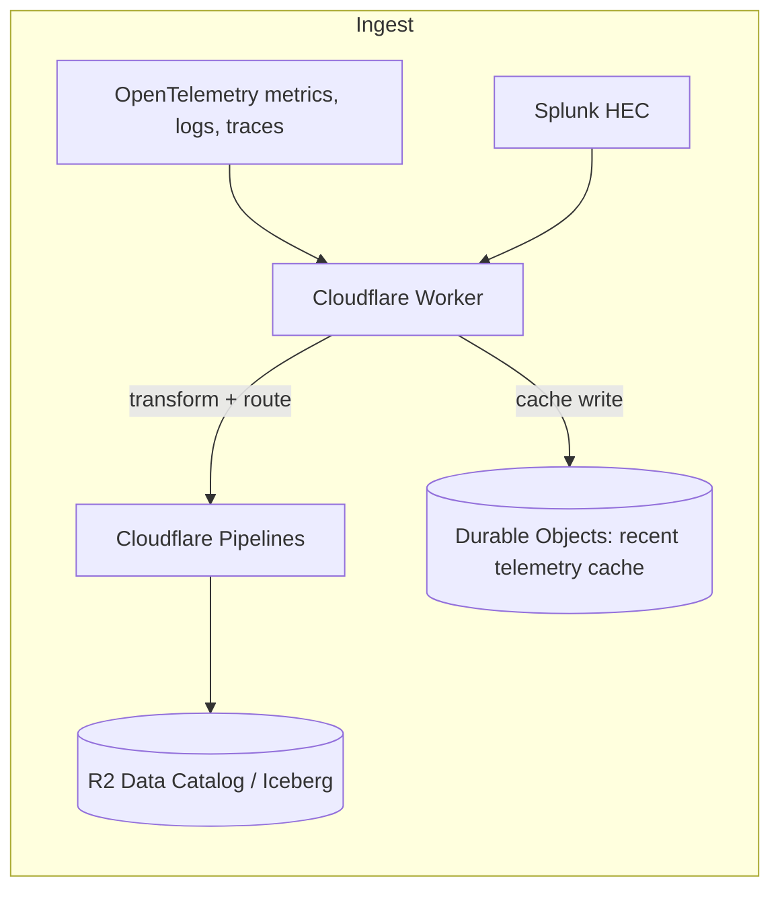

# otlpflare

Experimental Cloudflare Worker for telemetry ingestion to Cloudflare R2 Data Catalog (Apache Iceberg).

## What it does

Receives OpenTelemetry logs, traces, and metrics, plus Splunk HEC logs. Transforms them via [VRL](https://crates.io/crates/vrl) and forwards to [Cloudflare Pipelines](https://developers.cloudflare.com/pipelines/) for storage in [R2 Data Catalog](https://developers.cloudflare.com/r2/data-catalog/) tables using a [Clickhouse-inspired OpenTelemetry table schema](https://github.com/open-telemetry/opentelemetry-collector-contrib/tree/main/exporter/clickhouseexporter#traces).



## Why?

There are dozens on excellent open-source and paid monitoring tools and products to choose from, including many that store observerability data in parquet format in object storage.

The purpose of this project is to explore:

1. How advanced of a telemetry platform can we build, for cheap, using emerging services from Cloudflare like Pipelines, Durable Objects, and R2 Data Catalog?
2. How can we make long-term observability data easily accessible from analytics tools that support Apache Iceberg like duckdb, pandas, Trino, Anthena, etc?

## Setup

### 1. Create R2 API token

Go to **[R2 API Tokens](https://dash.cloudflare.com/?to=/:account/r2/api-tokens) → Create API Token**:
- Permissions: `Admin Read & Write`
- Scope: All buckets (or specify after bucket creation)
- Note: The R2 API Token is **different** from a regular Cloudflare API token.

Save the **Token value** for the next step.

### 2. Create pipeline environment

The setup script creates the R2 bucket, streams, sinks, and pipelines for all signal types (logs, traces, gauge, sum):

```bash
./scripts/pipeline-env.sh create <env-name> --token <R2_API_TOKEN>
```

For example:
```bash
./scripts/pipeline-env.sh create prod --token r2_xxxxx
```

This creates:
- R2 bucket: `otlpflare-<env-name>` with Data Catalog enabled
- Streams with schemas for each signal type
- Sinks targeting R2 Data Catalog tables
- Pipelines connecting streams to sinks
- Catalog maintenance (compaction + snapshot expiration)

The script generates a complete `wrangler.toml` with the stream endpoints configured.

### 3. Set auth secret

Create a Cloudflare API token with `Pipelines: Edit` permission:
```bash
npx wrangler secret put PIPELINE_AUTH_TOKEN
```

### 4. Deploy

```bash
npx wrangler deploy
```

### Other commands

```bash
# Check environment status
./scripts/pipeline-env.sh status <env-name>

# Preview what would be created
./scripts/pipeline-env.sh dry-run <env-name>

# Query tables with DuckDB
./scripts/pipeline-env.sh query <env-name>

# Delete environment
./scripts/pipeline-env.sh delete <env-name>
```

## Usage

Send OTLP logs:
```bash
curl -X POST https://otlpflare.<subdomain>.workers.dev/v1/logs \
  -H "Content-Type: application/json" \
  -d @sample-logs.json
```

Send OTLP traces:
```bash
curl -X POST https://otlpflare.<subdomain>.workers.dev/v1/traces \
  -H "Content-Type: application/json" \
  -d @sample-traces.json
```

Send OTLP metrics (gauge and sum):
```bash
curl -X POST https://otlpflare.<subdomain>.workers.dev/v1/metrics \
  -H "Content-Type: application/json" \
  -d @sample-metrics.json
```

Send Splunk HEC logs:
```bash
curl -X POST https://otlpflare.<subdomain>.workers.dev/services/collector/event \
  -H "Content-Type: application/json" \
  -d '{"time": 1702300000, "host": "web-1", "event": "User logged in"}'
```

HEC supports NDJSON (multiple events per request) and gzip compression.

Supports `Content-Type: application/x-protobuf` and `Content-Encoding: gzip`.

## Schema

See the `vrl/` directory, the schema written to R2 data catalog is defined inline the VRL transformation scripts.

If you'd like to change how data is stored in Iceberg, just modify the appropriate VRL files, recompile, and redeploy to a new Cloudflare Pipeline.

## Performance

R2 Data Catalog features like [automatic compaction and snapshot expiration](https://developers.cloudflare.com/r2/data-catalog/table-maintenance/) are enabled by default for performance reasons.

## Security

### Authentication

This worker does **not** implement application-level authentication.

### Input Validation

- Maximum payload size: 10 MB (after decompression)
- Maximum events per HEC request: 10,000
- Invalid JSON or timestamps are rejected with 400 errors
