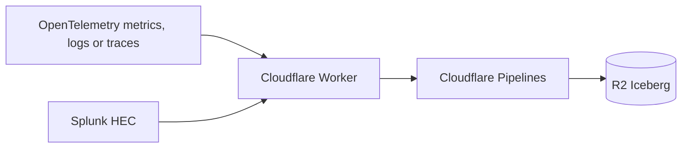

# otlpflare

Cloudflare Worker for telemetry ingestion to Cloudflare Pipelines.

Receives OpenTelemetry logs, traces, and metrics, plus Splunk HEC logs. Transforms them via [VRL](https://crates.io/crates/vrl) and forwards to [Cloudflare Pipelines](https://developers.cloudflare.com/pipelines/) for storage in [R2 Data Catalog](https://developers.cloudflare.com/r2/data-catalog/) using a [Clickhouse-inspired OpenTelemetry table schema](https://github.com/open-telemetry/opentelemetry-collector-contrib/tree/main/exporter/clickhouseexporter#traces).



## Setup

### 1. Create R2 bucket with data catalog

```bash
npx wrangler r2 bucket create otlpflare-logs
npx wrangler r2 bucket catalog enable otlpflare-logs
```

### 2. Create R2 API token

Go to **R2 → Manage R2 API Tokens → Create API Token**:
- Permissions: `Admin Read & Write`
- Specify bucket: `otlpflare-logs`

Save the **Token value** for sink creation.

### 3. Create Pipeline components

```bash
# Stream with schema
npx wrangler pipelines streams create otlpflare --schema-file schema.json

# Sink (R2 Data Catalog)
npx wrangler pipelines sinks create otlpflare_sink \
  --type r2-data-catalog \
  --bucket otlpflare-logs \
  --namespace default \
  --table logs \
  --catalog-token "<YOUR_R2_API_TOKEN>" \
  --format parquet \
  --compression zstd

# Pipeline
npx wrangler pipelines create otlpflare \
  --sql "INSERT INTO otlpflare_sink SELECT * FROM otlpflare"
```

### 4. Configure wrangler.toml

Set the stream endpoint (shown after stream creation):
```toml
[vars]
PIPELINE_ENDPOINT = "https://<stream-id>.ingest.cloudflare.com"
```

### 5. Set auth secret

Create a Cloudflare API token with `Pipelines: Edit` permission:
```bash
npx wrangler secret put PIPELINE_AUTH_TOKEN
```

### 6. Deploy

```bash
npx wrangler deploy
```

## Usage

Send OTLP logs:
```bash
curl -X POST https://otlpflare.<subdomain>.workers.dev/v1/logs \
  -H "Content-Type: application/json" \
  -d @sample-logs.json
```

Send OTLP traces:
```bash
curl -X POST https://otlpflare.<subdomain>.workers.dev/v1/traces \
  -H "Content-Type: application/json" \
  -d @sample-traces.json
```

Send OTLP metrics (gauge and sum):
```bash
curl -X POST https://otlpflare.<subdomain>.workers.dev/v1/metrics \
  -H "Content-Type: application/json" \
  -d @sample-metrics.json
```

Send Splunk HEC logs:
```bash
curl -X POST https://otlpflare.<subdomain>.workers.dev/services/collector/event \
  -H "Content-Type: application/json" \
  -d '{"time": 1702300000, "host": "web-1", "event": "User logged in"}'
```

HEC supports NDJSON (multiple events per request) and gzip compression.

Supports `Content-Type: application/x-protobuf` and `Content-Encoding: gzip`.

## Query Data

Query with R2 SQL:
```bash
npx wrangler r2 sql query otlpflare-logs "SELECT * FROM default.logs LIMIT 10"
```

Or connect with PyIceberg, Spark, or other Iceberg tools:
```
https://catalog.cloudflarestorage.com/<account-id>/otlpflare-logs
```

## Security

### Authentication

This worker does **not** implement application-level authentication. Instead, rely on infrastructure-level access controls:

- **Cloudflare Access**: Protect endpoints with Zero Trust policies
- **Cloudflare WAF**: Rate limiting and IP allowlisting
- **mTLS**: Client certificate authentication via Cloudflare

For Splunk HEC compatibility, the `Authorization: Splunk <token>` header is accepted but **not validated**. Use network-level controls to restrict access.

### Input Validation

- Maximum payload size: 10 MB (after decompression)
- Maximum events per HEC request: 10,000
- Invalid JSON or timestamps are rejected with 400 errors
