# otlp2pipeline

[](https://crates.io/crates/otlp2pipeline)
[](https://github.com/smithclay/otlp2pipeline/blob/main/LICENSE)

> Stream OpenTelemetry metrics, logs or traces to Cloudflare R2 Data Catalog (Apache Iceberg), Amazon S3 Tables (Apache Iceberg), or Azure ADLS Gen2 (Parquet).

## Table of Contents

- [What it does](#what-it-does)
- [Why?](#why)
- [Quickstart](#quickstart)
- [Cloudflare](#cloudflare)
- [AWS](#aws)
- [Azure](#azure)
- [Usage](#usage)
- [Schema](#schema)
- [Performance](#performance)
- [Security](#security)

## What it does

Receives OpenTelemetry logs, traces, and metrics and forwards via cloud pipelines for storage in AWS or Cloudflare R2 tables using a [Clickhouse-inspired OpenTelemetry table schema](https://github.com/open-telemetry/opentelemetry-collector-contrib/tree/main/exporter/clickhouseexporter#traces).

Cloudflare Pipelines or Amazon Data Firehose streams are used for batching and converting data to parquet format. Catalog maintenence features (compaction, snapshot pruning, partitioning by day) are enabled by default for performance.

## Why?

- Get a cheap and fully-managed Iceberg-compatible observability storage backend with a single command
- Do meaningful analytics on your metrics, logs, or traces using any any tool—or AI agent—that can connect to Iceberg data sources (duckdb, pandas, Trino, Athena, etc)

## Quickstart

Install the CLI:
```bash
# requires rust toolchain: `curl https://sh.rustup.rs -sSf | sh`
cargo install otlp2pipeline
```

### Deploy to Cloudflare

Requires the [wrangler CLI](https://developers.cloudflare.com/workers/wrangler/install-and-update/) connected to your Cloudflare account and an [R2 Token]([R2 API Tokens](https://dash.cloudflare.com/?to=/:account/r2/api-tokens).

```bash
# 1. Create R2 API token at https://dash.cloudflare.com/?to=/:account/r2/api-token
#    Permissions: Admin Read & Write

# 2. Initialize and create
otlp2pipeline init --provider cf --env cftest01
otlp2pipeline create --r2-token $R2_API_TOKEN --auth --output wrangler.toml

# 3a. Set token for worker to write to pipeline
# Go to https://dash.cloudflare.com/?to=/:account/api-tokens
# Create key with "Workers Pipelines: Edit" permissions
npx wrangler secret put PIPELINE_AUTH_TOKEN

# 3b. Deploy worker defined in wrangler.toml
npx wrangler deploy

# 4. Check status
otlp2pipeline status

# 5. Stream telemetry from an OTel Collector, Claude Code, or Codex
otlp2pipeline connect
```

### Deploy to AWS

Requires the [AWS CLI](https://aws.amazon.com/cli/) configured with appropiate credentials to create resources.

```bash
# 1. Initialize (requires AWS CLI configured)
otlp2pipeline init --provider aws --env awstest01 --region us-east-1

# 2. Deploy with authentication turned on
otlp2pipeline create --auth

# 3. Check status
otlp2pipeline status

# 4. Stream telemetry from an OTel Collector, Claude Code, or Codex
otlp2pipeline connect
```

### Deploy to Azure

Requires the [Azure CLI](https://learn.microsoft.com/cli/azure/install-azure-cli) installed and authenticated.

```bash
# 1. Authenticate with Azure CLI
az login

# 2. Initialize (requires Azure CLI configured)
otlp2pipeline init --provider azure --env azuretest01 --region westus

# 3. Deploy infrastructure
otlp2pipeline create

# 4. Check status
otlp2pipeline status

# 5. Send test events to Event Hub
cargo run --example azure_eventhub_poc --features azure
```

## Cloudflare

### Worker Architecture

```mermaid
flowchart TB
    subgraph Ingest["Ingest + Store"]
        OTLP[OTLP] --> W[Worker]
        W --> P[Pipelines]
        W --> DOs[(Durable Objects)]
        P --> R2[(R2 Data Catalog)]
    end

    subgraph Query["Query"]
        CLI[CLI / WebSocket] -->|real-time| W
        DuckDB[🦆 DuckDB] -->|batch| R2
    end
```



The worker uses Durable Objects for real-time RED metrics, see `openapi.yaml` for API details.

### 1. Create R2 API token

Go to **[R2 API Tokens](https://dash.cloudflare.com/?to=/:account/r2/api-tokens) → Create API Token**:
- Permissions: `Admin Read & Write`
- Scope: All buckets (or specify after bucket creation)
- Note: The R2 API Token is **different** from a regular Cloudflare API token.

Login with the wrangler CLI `npx wrangler login`

Save the **Token value** for the next step.

### 2. Install CLI

```bash
cargo install otlp2pipeline
```

### 3. Initialize project

```bash
# Initialize config file (.otlp2pipeline.toml)
otlp2pipeline init --provider cf --env prod
```

### 4. Create pipeline environment

The CLI creates the R2 bucket, streams, sinks, and pipelines for all signal types:

```bash
# Preview what would be created
otlp2pipeline plan

# Create environment with authentication enabled (recommended)
otlp2pipeline create --r2-token <R2_API_TOKEN> --auth --output wrangler.toml
```

This creates:
- R2 bucket: `otlp2pipeline-<env-name>` with Data Catalog enabled
- Streams with schemas for each signal type
- Sinks targeting R2 Data Catalog tables
- Pipelines connecting streams to sinks
- Catalog maintenance (compaction + snapshot expiration)

### 5. Deploy

```bash
# Go to https://dash.cloudflare.com/?to=/:account/api-tokens
# Create key with "Workers Pipelines: Edit" permissions
npx wrangler secret put PIPELINE_AUTH_TOKEN

npx wrangler deploy
```

### 6. Verify

```bash
curl -X POST http://<WORKER URL>/v1/logs \
  -H "Content-Type: application/json" \
  -d '{"resourceLogs":[{"scopeLogs":[{"logRecords":[{"body":{"stringValue":"hello world"}}]}]}]}'

# Query tables with DuckDB, by default data is available after ~5 minutes
otlp2pipeline query

# Send other data sources
otlp2pipeline connect
```

### Cloudflare-specific CLI commands

Cloudflare has additional features like live tail log/traces and real-time RED metrics.

```bash
# List known services
otlp2pipeline services --url https://your-worker.workers.dev

# Stream live logs
otlp2pipeline tail my-service logs

# Stream live traces
otlp2pipeline tail my-service traces
```

## AWS

### Lambda Architecture

```mermaid
flowchart TB
    subgraph Ingest["Ingest + Store"]
        OTLP[OTLP] --> L[Lambda]
        L --> F[Data Firehose]
        F --> S3[(S3 Tables / Iceberg)]
    end

    subgraph Query["Query"]
        DuckDB[🦆 DuckDB] -->|batch| S3
        Athena[Athena / Trino] -->|batch| S3
    end
```



### 1. Install AWS CLI

Install and configure the [AWS CLI](https://docs.aws.amazon.com/cli/latest/userguide/getting-started-install.html):

Ensure your IAM user/role has permissions for:
- CloudFormation (create/update/delete stacks)
- S3 Tables (create buckets, tables)
- Kinesis Firehose (create delivery streams)
- Lambda (create functions)
- Lake Formation (grant permissions)
- IAM (create roles)

```bash
# Configure credentials
aws configure
```

### 2. Install CLI

```bash
cargo install otlp2pipeline
```

### 3. Initialize project

```bash
# Initialize config file (.otlp2pipeline.toml)
otlp2pipeline init --provider aws --env prod --region us-east-1
```

This auto-detects your AWS account ID and stores configuration locally.

### 4. Deploy

```bash
# Preview what would be created
otlp2pipeline plan

# Deploy all infrastructure with authentication (recommended)
otlp2pipeline create --auth
```

This deploys:
- S3 Tables bucket with Iceberg catalog
- Tables for logs, traces, sum metrics, and gauge metrics (via Athena DDL)
- Lake Formation permissions and Glue catalog federation
- CloudFormation stack (IAM roles, CloudWatch logs, error bucket)
- Kinesis Firehose delivery streams with S3 Tables destination
- Lambda function with public Function URL

### 5. Verify

```bash
# Check deployment status
otlp2pipeline status

curl -X POST http://<LAMBDA FUNCTION URL>/v1/logs \
  -H "Content-Type: application/json" \
  -d '{"resourceLogs":[{"scopeLogs":[{"logRecords":[{"body":{"stringValue":"hello world"}}]}]}]}'

# Query tables with DuckDB, by default data is available after ~5 minutes
otlp2pipeline query

# Send other data sources
otlp2pipeline connect
```

## Azure

### Stream Analytics Architecture

```mermaid
flowchart TB
    subgraph Ingest["Ingest + Store"]
        OTLP[OTLP] --> EH[Event Hub]
        EH --> SA[Stream Analytics]
        SA --> ADLS[(ADLS Gen2 / Parquet)]
    end

    subgraph Query["Query"]
        DuckDB[🦆 DuckDB] -->|batch| ADLS
        Synapse[Synapse / Spark] -->|batch| ADLS
    end
```



### 1. Install Azure CLI

Install and configure the [Azure CLI](https://learn.microsoft.com/cli/azure/install-azure-cli):

```bash
# macOS
brew install azure-cli

# Linux
curl -sL https://aka.ms/InstallAzureCLIDeb | sudo bash

# Windows
# Download from https://aka.ms/installazurecliwindows

# Authenticate
az login

# Verify authentication and view subscription
az account show

# (Optional) Set a specific subscription if you have multiple
az account set --subscription <subscription-id-or-name>
```

Ensure your Azure account has permissions for:
- Event Hubs (create namespaces and event hubs)
- Stream Analytics (create jobs, inputs, outputs)
- Storage Accounts (create ADLS Gen2 accounts and containers)
- Resource Groups (create/manage resources)

### 2. Install CLI

```bash
cargo install otlp2pipeline
```

### 3. Initialize project

```bash
# Initialize config file (.otlp2pipeline.toml)
otlp2pipeline init --provider azure --env prod --region westus
```

This stores configuration locally for your Azure subscription.

### 4. Deploy

```bash
# Preview what would be created
otlp2pipeline plan

# Deploy all infrastructure with authentication (recommended)
otlp2pipeline create --auth
```

This deploys:
- Event Hub namespace and event hub for OTLP ingestion
- Stream Analytics job with routing query (routes by signal type)
- ADLS Gen2 storage account with containers for logs, traces, and metrics
- Parquet outputs with 5-minute batching windows
- Resource group containing all resources

### 5. Verify

```bash
# Check deployment status
otlp2pipeline status

# Send test events to Event Hub using the PoC example
cargo run --example azure_eventhub_poc --features azure

# Query tables with DuckDB, by default data is available after ~5 minutes
otlp2pipeline query
```

Note: The Azure integration currently requires sending data directly to Event Hub. An HTTP ingestion endpoint (Azure Function) is planned for a future release.

## Usage

- Connect telemetry to your pipeline from any OTLP source, including Claude Code or Codex. Run `otlp2pipeline connect` for instructions and setup.
- After deployment, Run `otlp2pipline query` to start a live duckdb terminal to query your cloud telemetry.

## Schema

Schema definitions are sourced from `otlp2records` and written to the R2 data catalog at build time.

If you'd like to change how data is stored in Iceberg, modify the VRL files in the `otlp2records` repo, recompile, and redeploy to a new Cloudflare Pipeline.

## Performance

R2 Data Catalog features like [automatic compaction and snapshot expiration](https://developers.cloudflare.com/r2/data-catalog/table-maintenance/) are enabled by default for performance reasons.

## Security

### Authentication

This worker does **not** implement application-level authentication.

### Input Validation

- Maximum payload size: 10 MB (after decompression)
- Invalid JSON or timestamps are rejected with 400 errors
- Service names: alphanumeric, hyphens, underscores, dots only (max 128 chars)
- Service registry limit: 10,000 unique services (returns 507 if exceeded)
