```mermaid
flowchart TB
    subgraph Ingest["Ingest + Store"]
        OTLP[OTLP] --> W[Worker]
        HEC[Splunk HEC] --> W
        W --> P[Pipelines]
        W --> DOs[(Durable Objects)]
        P --> R2[(R2 Data Catalog)]
    end

    subgraph Query["Query"]
        CLI[CLI / WebSocket] -->|real-time| W
        DuckDB[🦆 DuckDB] -->|batch| R2
    end
```

# otlp2pipeline

[](https://crates.io/crates/otlp2pipeline)
[](https://github.com/smithclay/otlp2pipeline/blob/main/LICENSE)

Experimental Cloudflare Worker for telemetry ingestion to Cloudflare R2 Data Catalog (Apache Iceberg).

## What it does

Receives OpenTelemetry logs, traces, and metrics, plus Splunk HEC logs. Transforms them via [VRL](https://crates.io/crates/vrl) and forwards to [Cloudflare Pipelines](https://developers.cloudflare.com/pipelines/) for storage in [R2 Data Catalog](https://developers.cloudflare.com/r2/data-catalog/) tables using a [Clickhouse-inspired OpenTelemetry table schema](https://github.com/open-telemetry/opentelemetry-collector-contrib/tree/main/exporter/clickhouseexporter#traces).



## Why?

Purpose of this project is to explore the idea of a "serverless" observability backend built around object storage using emerging managed services from Cloudflare.

Using new query engines like duckdb, this makes long term analytics of observability data cheap and feasible with any tool that can query Apache Iceberg data sources (duckdb, pandas, Trino, Athena, etc).

## Setup

### 1. Create R2 API token

Go to **[R2 API Tokens](https://dash.cloudflare.com/?to=/:account/r2/api-tokens) → Create API Token**:
- Permissions: `Admin Read & Write`
- Scope: All buckets (or specify after bucket creation)
- Note: The R2 API Token is **different** from a regular Cloudflare API token.

Save the **Token value** for the next step.

### 2. Install CLI

```bash
cargo install otlp2pipeline
```

### 3. Initialize project

```bash
# Initialize config file (.otlp2pipeline.toml)
otlp2pipeline init --provider cf --env prod
```

### 4. Create pipeline environment

The CLI creates the R2 bucket, streams, sinks, and pipelines for all signal types:

```bash
# Preview what would be created
otlp2pipeline plan

# Create environment
otlp2pipeline create --r2-token <R2_API_TOKEN> --output wrangler.toml
```

This creates:
- R2 bucket: `otlp2pipeline-<env-name>` with Data Catalog enabled
- Streams with schemas for each signal type
- Sinks targeting R2 Data Catalog tables
- Pipelines connecting streams to sinks
- Catalog maintenance (compaction + snapshot expiration)

### 5. Deploy

```bash
npx wrangler deploy
```

### CLI commands

```bash
# Check environment status
otlp2pipeline status

# Preview what would be created
otlp2pipeline plan

# Query tables with DuckDB
otlp2pipeline query

# List known services
otlp2pipeline services --url https://your-worker.workers.dev

# Stream live logs
otlp2pipeline tail my-service logs

# Stream live traces
otlp2pipeline tail my-service traces

# Delete environment
otlp2pipeline destroy --force
```

## Usage

Send OTLP logs:
```bash
curl -X POST https://otlp2pipeline.<subdomain>.workers.dev/v1/logs \
  -H "Content-Type: application/json" \
  -d @sample-logs.json
```

Send OTLP traces:
```bash
curl -X POST https://otlp2pipeline.<subdomain>.workers.dev/v1/traces \
  -H "Content-Type: application/json" \
  -d @sample-traces.json
```

Send OTLP metrics (gauge and sum):
```bash
curl -X POST https://otlp2pipeline.<subdomain>.workers.dev/v1/metrics \
  -H "Content-Type: application/json" \
  -d @sample-metrics.json
```

Send Splunk HEC logs:
```bash
curl -X POST https://otlp2pipeline.<subdomain>.workers.dev/services/collector/event \
  -H "Content-Type: application/json" \
  -d '{"time": 1702300000, "host": "web-1", "event": "User logged in"}'
```

HEC supports NDJSON (multiple events per request) and gzip compression.

Supports `Content-Type: application/x-protobuf` and `Content-Encoding: gzip`.

Query aggregated stats (per-minute RED metrics):
```bash
# Get log stats for a service
curl https://otlp2pipeline.<subdomain>.workers.dev/v1/services/my-service/logs/stats

# Get trace stats with time filter (minutes since epoch)
curl https://otlp2pipeline.<subdomain>.workers.dev/v1/services/my-service/traces/stats?from=29000000&to=29000060
```

Stats include count, error_count, and latency metrics (traces only).

List all registered services:
```bash
curl https://otlp2pipeline.<subdomain>.workers.dev/v1/services
```

Returns services with signal availability (has_logs, has_traces, has_metrics) and first_seen_at timestamp.

Stream logs or traces in real-time via WebSocket:
```bash
# Connect to live tail for a service's logs
websocat wss://otlp2pipeline.<subdomain>.workers.dev/v1/tail/my-service/logs

# Connect to live tail for a service's traces
websocat wss://otlp2pipeline.<subdomain>.workers.dev/v1/tail/my-service/traces
```

LiveTail uses WebSocket hibernation for zero cost when no clients are connected.

## Schema

See the `vrl/` directory, the schema written to R2 data catalog is defined inline the VRL transformation scripts.

If you'd like to change how data is stored in Iceberg, just modify the appropriate VRL files, recompile, and redeploy to a new Cloudflare Pipeline.

## Performance

R2 Data Catalog features like [automatic compaction and snapshot expiration](https://developers.cloudflare.com/r2/data-catalog/table-maintenance/) are enabled by default for performance reasons.

## Security

### Authentication

This worker does **not** implement application-level authentication.

### Input Validation

- Maximum payload size: 10 MB (after decompression)
- Maximum events per HEC request: 10,000
- Invalid JSON or timestamps are rejected with 400 errors
- Service names: alphanumeric, hyphens, underscores, dots only (max 128 chars)
- Service registry limit: 10,000 unique services (returns 507 if exceeded)
