# otlp2pipeline

[](https://crates.io/crates/otlp2pipeline)
[](https://github.com/smithclay/otlp2pipeline/blob/main/LICENSE)

> Stream OpenTelemetry metrics, logs or traces to Cloudflare R2 Data Catalog or Amazon S3 Tables (Apache Iceberg).

## What it does

Receives OpenTelemetry logs, traces, and metrics (plus Splunk HEC logs). Transforms them via [VRL](https://crates.io/crates/vrl) and forwards via pipelines for long-term storage in AWS or Cloudflare R2 tables using a [Clickhouse-inspired OpenTelemetry table schema](https://github.com/open-telemetry/opentelemetry-collector-contrib/tree/main/exporter/clickhouseexporter#traces).

Cloudflare Pipelines or Amazon Data Firehose streams are used for batching and data delivery and converting the data to parquet format. Catalog maintenence features (compaction, snapshot pruning) are enabled by default for performance.

## Why?

Purpose of this project is to explore the idea of a fully-managed observability backend built around a data lake using emerging managed services from Cloudflare and AWS.

Using new query engines like duckdb, this makes long term analytics of observability data cheap and feasible with any tool—or AI agent—that can query Apache Iceberg data sources (duckdb, pandas, Trino, Athena, etc).

## Quickstart

Install the CLI:
```bash
# requires rust toolchain: `curl https://sh.rustup.rs -sSf | sh`
cargo install otlp2pipeline
```

### Deploy to Cloudflare

Requires the [wrangler CLI](https://developers.cloudflare.com/workers/wrangler/install-and-update/) connected to your Cloudflare account and an [R2 Token]([R2 API Tokens](https://dash.cloudflare.com/?to=/:account/r2/api-tokens).

```bash
# 1. Create R2 API token at https://dash.cloudflare.com/?to=/:account/r2/api-token
#    Permissions: Admin Read & Write

# 2. Initialize and create
otlp2pipeline init --provider cf --env cftest01
otlp2pipeline create --r2-token $R2_API_TOKEN --output wrangler.toml

# 3. Deploy worker defined in wrangler.toml
npx wrangler deploy

# 4. Check status
otlp2pipeline status

# 5. Stream telemetry from an OTel Collector, Claude Code, or Codex
otlp2pipeline connect
```

### Deploy to AWS

Requires a locally configured `aws` CLI connected to your AWS account.

```bash
# 1. Initialize (requires AWS CLI configured)
otlp2pipeline init --provider aws --env awstest01 --region us-east-1

# 2. Generate CloudFormation template
otlp2pipeline create --output template.yaml

# 3. Deploy S3 Tables and Firehoses defined in template.yaml
# The script is needed as some configuration is not supported by Cloudformation (yet)
./scripts/aws-deploy.sh template.yaml --env awstest01 --region us-east-1

# 4. Check status
otlp2pipeline status

# 5. Stream telemetry from an OTel Collector, Claude Code, or Codex
otlp2pipeline connect
```

## Cloudflare

### Worker Architecture

```mermaid
flowchart TB
    subgraph Ingest["Ingest + Store"]
        OTLP[OTLP] --> W[Worker]
        HEC[Splunk HEC] --> W
        W --> P[Pipelines]
        W --> DOs[(Durable Objects)]
        P --> R2[(R2 Data Catalog)]
    end

    subgraph Query["Query"]
        CLI[CLI / WebSocket] -->|real-time| W
        DuckDB[🦆 DuckDB] -->|batch| R2
    end
```



The worker uses Durable Objects for real-time RED metrics, see `openapi.yaml` for API details.

### 1. Create R2 API token

Go to **[R2 API Tokens](https://dash.cloudflare.com/?to=/:account/r2/api-tokens) → Create API Token**:
- Permissions: `Admin Read & Write`
- Scope: All buckets (or specify after bucket creation)
- Note: The R2 API Token is **different** from a regular Cloudflare API token.

Login with the wrangler CLI `npx wrangler login`

Save the **Token value** for the next step.

### 2. Install CLI

```bash
cargo install otlp2pipeline
```

### 3. Initialize project

```bash
# Initialize config file (.otlp2pipeline.toml)
otlp2pipeline init --provider cf --env prod
```

### 4. Create pipeline environment

The CLI creates the R2 bucket, streams, sinks, and pipelines for all signal types:

```bash
# Preview what would be created
otlp2pipeline plan

# Create environment
otlp2pipeline create --r2-token <R2_API_TOKEN> --output wrangler.toml
```

This creates:
- R2 bucket: `otlp2pipeline-<env-name>` with Data Catalog enabled
- Streams with schemas for each signal type
- Sinks targeting R2 Data Catalog tables
- Pipelines connecting streams to sinks
- Catalog maintenance (compaction + snapshot expiration)

### 5. Deploy

```bash
npx wrangler deploy
```

### CLI commands

```bash
# Check environment status
otlp2pipeline status

# Preview what would be created
otlp2pipeline plan

# Query tables with DuckDB
otlp2pipeline query

# List known services
otlp2pipeline services --url https://your-worker.workers.dev

# Stream live logs
otlp2pipeline tail my-service logs

# Stream live traces
otlp2pipeline tail my-service traces

# Delete environment
otlp2pipeline destroy --force
```

## AWS

### Lambda Architecture

```mermaid
flowchart TB
    subgraph Ingest["Ingest + Store"]
        OTLP[OTLP] --> L[Lambda]
        HEC[Splunk HEC] --> L
        L --> F[Data Firehose]
        F --> S3[(S3 Tables / Iceberg)]
    end

    subgraph Query["Query"]
        DuckDB[🦆 DuckDB] -->|batch| S3
        Athena[Athena / Trino] -->|batch| S3
    end
```



### 1. Install AWS CLI

Install and configure the [AWS CLI](https://docs.aws.amazon.com/cli/latest/userguide/getting-started-install.html):

```bash
# Verify installation
aws --version

# Configure credentials
aws configure
```

Ensure your IAM user/role has permissions for:
- CloudFormation (create/update/delete stacks)
- S3 Tables (create buckets, tables)
- Kinesis Firehose (create delivery streams)
- Lambda (create functions)
- Lake Formation (grant permissions)
- IAM (create roles)

### 2. Install CLI

```bash
cargo install otlp2pipeline
```

### 3. Initialize project

```bash
# Initialize config file (.otlp2pipeline.toml)
otlp2pipeline init --provider aws --env prod --region us-east-1
```

This auto-detects your AWS account ID and stores configuration locally.

### 4. Create CloudFormation template

```bash
# Preview what would be created
otlp2pipeline plan

# Generate CloudFormation template
otlp2pipeline create --output template.yaml
```

This creates a CloudFormation template with:
- S3 Tables bucket with Data Catalog (Iceberg format)
- Tables for logs, traces, sum metrics, and gauge metrics
- Kinesis Firehose delivery streams for each signal type
- Lambda function for OTLP ingestion
- Lambda Function URL (public HTTP endpoint)
- Lake Formation permissions
- CloudWatch logging and error alarms

### 5. Deploy

```bash
# Deploy infrastructure (S3 Tables, Lambda, Firehose, Lake Formation)
./scripts/aws-deploy.sh template.yaml --env prod --region us-east-1

# Check status
otlp2pipeline status

# Test with sample data
./scripts/aws-send-test-record.sh otlp2pipeline-prod us-east-1
```

The deploy script handles:
- Lake Formation setup and permissions
- CloudFormation stack deployment
- Firehose stream creation with S3 Tables destination

## Usage

- Connect telemetry to your pipeline from any OTLP source, including Claude Code or Codex. Run `otlp2pipeline connect` for instructions and setup.
- After deployment, Run `otlp2pipline query` to start a live duckdb terminal to query your cloud telemetry.

## Schema

See the `vrl/` directory, the schema written to R2 data catalog is defined inline the VRL transformation scripts.

If you'd like to change how data is stored in Iceberg, just modify the appropriate VRL files, recompile, and redeploy to a new Cloudflare Pipeline.

## Performance

R2 Data Catalog features like [automatic compaction and snapshot expiration](https://developers.cloudflare.com/r2/data-catalog/table-maintenance/) are enabled by default for performance reasons.

## Security

### Authentication

This worker does **not** implement application-level authentication.

### Input Validation

- Maximum payload size: 10 MB (after decompression)
- Maximum events per HEC request: 10,000
- Invalid JSON or timestamps are rejected with 400 errors
- Service names: alphanumeric, hyphens, underscores, dots only (max 128 chars)
- Service registry limit: 10,000 unique services (returns 507 if exceeded)
