# otlp2pipeline

[](https://crates.io/crates/otlp2pipeline)
[](https://github.com/smithclay/otlp2pipeline/blob/main/LICENSE)

> Stream OpenTelemetry data to Cloudflare R2 Data Catalog, Amazon S3 Tables, or Azure ADLS Gen2.

## Table of Contents

- [What it does](#what-it-does)
- [Why?](#why)
- [Quickstart](#quickstart)
- [Cloudflare](#cloudflare)
- [AWS](#aws)
- [Azure](#azure)
- [Schema](#schema)
- [Performance](#performance)
- [Security](#security)

## What it does

Receives OpenTelemetry data and routes it to object storage via cloud-native pipelines. Data lands in Parquet format using a [Clickhouse-inspired schema](https://github.com/open-telemetry/opentelemetry-collector-contrib/tree/main/exporter/clickhouseexporter#traces).

Cloud services handle batching and format conversion. Catalog maintenance (compaction, snapshot expiration) runs automatically. Only want to do some simple OTLP->Parquet conversion without the cloud bells and whistles? Check out [otlp2parquet](https://github.com/smithclay/otlp2parquet).

## Why?

- Deploy a managed Iceberg observability backend with one command
- Query with any tool that reads Iceberg: DuckDB, Pandas, Trino, Athena, AI agents

## Quickstart

Install the CLI for your favorite cloud provider:

```bash
# requires rust toolchain: `curl https://sh.rustup.rs -sSf | sh`
cargo install otlp2pipeline

# Create a new project to deploy on AWS (requires AWS CLI)
otlp2pipeline init --provider aws --env awstest01 --region us-east-1

# or create a new project with Cloudflare (requires the wrangler CLI)
otlp2pipeline init --provider cf --env cftest01

# or create a new project with Azure (requires Azure CLI)
otlp2pipeline init --provider azure --env azuretest01 --region westus

# see what will be created automatically
otlp2pipeline plan
```

### Deploy to Cloudflare

Requires the [wrangler CLI](https://developers.cloudflare.com/workers/wrangler/install-and-update/).

```bash
# 1. `init` a Cloudflare project as described above

# 2. Create R2 API token (Admin Read & Write)
#    https://dash.cloudflare.com/?to=/:account/r2/api-token

#3. Create pipelines
otlp2pipeline create --auth --r2-token $R2_API_TOKEN --output wrangler.toml

# 3a. Set token for worker to write to pipeline
# Go to https://dash.cloudflare.com/?to=/:account/api-tokens
# Create key with "Workers Pipelines: Edit" permissions
npx wrangler secret put PIPELINE_AUTH_TOKEN

# 3b. Deploy worker defined in wrangler.toml
npx wrangler deploy
```

### Deploy to AWS or Azure

Requires the [AWS CLI](https://aws.amazon.com/cli/) or [Azure CLI](https://learn.microsoft.com/cli/azure/install-azure-cli) configured with appropiate credentials to create resources.

```bash
# 1. `init` an AWS/Azure project as described above

# 2. Deploy with authentication turned on
otlp2pipeline create --auth
```

### Check status and connect Claude Code, Collectors, or Codex

```bash
# Verify successful deployment
otlp2pipeline status

# How to stream telemetry from different sources
otlp2pipeline connect

# Query tables with DuckDB, by default data is available after ~5 minutes
otlp2pipeline query
```

## Cloudflare

### Worker Architecture

```mermaid
flowchart TB
    subgraph Ingest["Ingest + Store"]
        OTLP[OTLP] --> W[Worker]
        W --> P[Pipelines]
        W --> DOs[(Durable Objects)]
        P --> R2[(R2 Data Catalog / Iceberg)]
    end

    subgraph Query["Query"]
        CLI[CLI / WebSocket] -->|real-time| W
        DuckDB[🦆 DuckDB] --> R2
    end
```



The worker uses Durable Objects for real-time RED metrics, see `openapi.yaml` for API details.

### Cloudflare-specific CLI commands

Cloudflare has additional features like live tail log/traces and real-time RED metrics.

```bash
# List known services
otlp2pipeline services --url https://your-worker.workers.dev

# Stream live logs
otlp2pipeline tail my-service logs

# Stream live traces
otlp2pipeline tail my-service traces
```

## AWS

### Lambda Architecture

```mermaid
flowchart TB
    subgraph Ingest["Ingest + Store"]
        OTLP[OTLP] --> L[Lambda]
        L --> F[Data Firehose]
        F --> S3[(S3 Tables / Iceberg)]
    end

    subgraph Query["Query"]
        DuckDB[🦆 DuckDB] --> S3
        Athena[Athena / Trino] --> S3
    end
```



## Azure

> **Fabric users:** [Eventstreams](https://learn.microsoft.com/en-us/fabric/real-time-intelligence/event-streams/overview?tabs=enhancedcapabilities) can replace Stream Analytics for Azure Data Lake ingestion.

### Stream Analytics Architecture

```mermaid
flowchart TB
    subgraph Ingest["Ingest + Store"]
        OTLP[OTLP] --> CA[Container App]
        CA --> EH[Event Hub]
        EH --> SA[Stream Analytics]
        SA --> ADLS[(ADLS Gen2 / Parquet)]
    end

    subgraph Query["Query"]
        DuckDB[🦆 DuckDB] --> ADLS
        Synapse[Synapse / Spark] --> ADLS
    end
```



## Schema

Schemas come from the [`otlp2records` library](https://github.com/smithclay/otlp2records) and generate at build time. The same schema is used by the [otlp2parquet](https://github.com/smithclay/otlp2parquet) and [duckdb-otlp](https://github.com/smithclay/duckdb-otlp) projects.

## Performance

[Compaction and snapshot expiration](https://developers.cloudflare.com/r2/data-catalog/table-maintenance/) run automatically where supported.

## Security

### Authentication

No built-in authentication. Use `--auth` flag (see Quickstart).

### Input Validation

- Maximum payload size: 10 MB (after decompression)
- Invalid JSON or timestamps are rejected with 400 errors
- Service names: alphanumeric, hyphens, underscores, dots only (max 128 chars)
- Service registry limit: 10,000 unique services (returns 507 if exceeded)
