# otlp2pipeline

[](https://crates.io/crates/otlp2pipeline)
[](https://github.com/smithclay/otlp2pipeline/blob/main/LICENSE)

> Stream OpenTelemetry metrics, logs or traces to Cloudflare R2 Data Catalog (Apache Iceberg), Amazon S3 Tables (Apache Iceberg), or Azure ADLS Gen2 (Parquet).

## Table of Contents

- [What it does](#what-it-does)
- [Why?](#why)
- [Quickstart](#quickstart)
- [Cloudflare](#cloudflare)
- [AWS](#aws)
- [Azure](#azure)
- [Schema](#schema)
- [Performance](#performance)
- [Security](#security)

## What it does

Receives OpenTelemetry logs, traces, and metrics and forwards via cloud pipelines for storage in AWS or Cloudflare R2 tables using a [Clickhouse-inspired OpenTelemetry table schema](https://github.com/open-telemetry/opentelemetry-collector-contrib/tree/main/exporter/clickhouseexporter#traces).

Cloudflare Pipelines, Amazon Data Firehose, or Azure Data Analytics pipelines are used for batching and converting data to parquet format. Catalog maintenence features, where they exist, (compaction, snapshot pruning, partitioning by day) are enabled by default for performance.

## Why?

- Get a cheap and fully-managed Iceberg-compatible observability storage backend with a single command
- Do meaningful analytics on your metrics, logs, or traces using any any tool—or AI agent—that can connect to Iceberg data sources (duckdb, pandas, Trino, Athena, etc)

## Quickstart

Install the CLI and choose a cloud:

```bash
# requires rust toolchain: `curl https://sh.rustup.rs -sSf | sh`
cargo install otlp2pipeline

# Create a new project to deploy on aws
otlp2pipeline init --provider aws --env awstest01 --region us-east-1

# or create a new project with Cloudflare (requires the wrangler CLI configured)
otlp2pipeline init --provider cf --env cftest01

# or create a new project with Azure (requires Azure CLI configured)
otlp2pipeline init --provider azure --env azuretest01 --region westus
```

### Deploy to Cloudflare

Requires the [wrangler CLI](https://developers.cloudflare.com/workers/wrangler/install-and-update/).

```bash
# 1. `init` a Cloudflare project as described above

# 2. Create R2 API token at https://dash.cloudflare.com/?to=/:account/r2/api-token
#    Permissions: Admin Read & Write

#3. Create pipelines
otlp2pipeline create --r2-token $R2_API_TOKEN --auth --output wrangler.toml

# 3a. Set token for worker to write to pipeline
# Go to https://dash.cloudflare.com/?to=/:account/api-tokens
# Create key with "Workers Pipelines: Edit" permissions
npx wrangler secret put PIPELINE_AUTH_TOKEN

# 3b. Deploy worker defined in wrangler.toml
npx wrangler deploy
```

### Deploy to AWS

Requires the [AWS CLI](https://aws.amazon.com/cli/) configured with appropiate credentials to create resources.

```bash
# 1. `init` an AWS project as described above using `init`

# 2. Deploy with authentication turned on
otlp2pipeline create --auth
```

### Deploy to Azure

Requires the [Azure CLI](https://learn.microsoft.com/cli/azure/install-azure-cli) installed and authenticated.

```bash
# 1. Create an Azure project as described above using `init`

# 2. Deploy with authentication turned on
otlp2pipeline create --auth
```

### Check status and connect Claude Code, Collectors, or Codex

```bash
# Verify successful deployment
otlp2pipeline status

# How to stream telemetry from different sources
otlp2pipeline connect

# Query tables with DuckDB, by default data is available after ~5 minutes
otlp2pipeline query
```

## Cloudflare

### Worker Architecture

```mermaid
flowchart TB
    subgraph Ingest["Ingest + Store"]
        OTLP[OTLP] --> W[Worker]
        W --> P[Pipelines]
        W --> DOs[(Durable Objects)]
        P --> R2[(R2 Data Catalog / Iceberg)]
    end

    subgraph Query["Query"]
        CLI[CLI / WebSocket] -->|real-time| W
        DuckDB[🦆 DuckDB] --> R2
    end
```



The worker uses Durable Objects for real-time RED metrics, see `openapi.yaml` for API details.

### Cloudflare-specific CLI commands

Cloudflare has additional features like live tail log/traces and real-time RED metrics.

```bash
# List known services
otlp2pipeline services --url https://your-worker.workers.dev

# Stream live logs
otlp2pipeline tail my-service logs

# Stream live traces
otlp2pipeline tail my-service traces
```

## AWS

### Lambda Architecture

```mermaid
flowchart TB
    subgraph Ingest["Ingest + Store"]
        OTLP[OTLP] --> L[Lambda]
        L --> F[Data Firehose]
        F --> S3[(S3 Tables / Iceberg)]
    end

    subgraph Query["Query"]
        DuckDB[🦆 DuckDB] --> S3
        Athena[Athena / Trino] --> S3
    end
```



## Azure

### Stream Analytics Architecture

```mermaid
flowchart TB
    subgraph Ingest["Ingest + Store"]
        OTLP[OTLP] --> CA[Container App]
        CA --> EH[Event Hub]
        EH --> SA[Stream Analytics]
        SA --> ADLS[(ADLS Gen2 / Parquet)]
    end

    subgraph Query["Query"]
        DuckDB[🦆 DuckDB] --> ADLS
        Synapse[Synapse / Spark] --> ADLS
    end
```



## Schema

Schema definitions are sourced from `otlp2records` and written to the data source at build time. The schemas are defined in the `otlp2records` repostiory.

## Performance

Iceberg Catalog features like [automatic compaction and snapshot expiration](https://developers.cloudflare.com/r2/data-catalog/table-maintenance/) are enabled by default for performance reasons (where they exist)

## Security

### Authentication

This worker does **not** implement application-level authentication.

### Input Validation

- Maximum payload size: 10 MB (after decompression)
- Invalid JSON or timestamps are rejected with 400 errors
- Service names: alphanumeric, hyphens, underscores, dots only (max 128 chars)
- Service registry limit: 10,000 unique services (returns 507 if exceeded)
